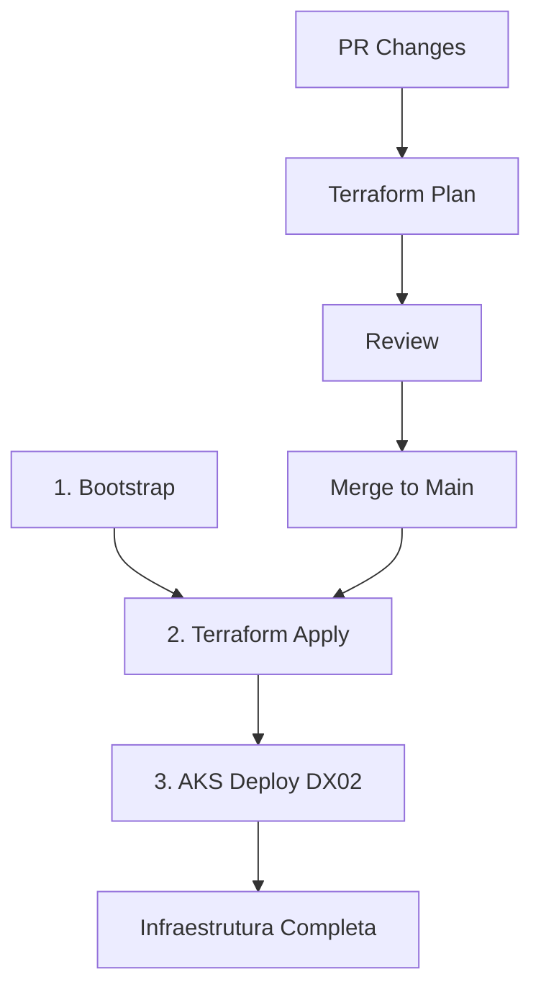

# 🚀 TX02 Bootstrap Guide - CI/CD Automated Setup

Este guia documenta o processo completo de bootstrap da infraestrutura TX02 via GitHub Actions.

## 📋 Pré-requisitos

Antes de executar o bootstrap, certifique-se de que você configurou:

### 1. GitHub Secrets Necessários

No repositório **maringelix/tx02**, configure os seguintes secrets em `Settings → Secrets and variables → Actions → New repository secret`:

#### Secrets Obrigatórios

| Secret Name | Descrição | Como Obter |
|------------|-----------|------------|
| `AZURE_CREDENTIALS` | JSON de autenticação do Service Principal | Veja seção abaixo |
| `TF_VAR_db_password` | Senha do PostgreSQL (min 8 chars, com maiúsculas, minúsculas e números) | Gere uma senha forte |
| `TF_VAR_admin_password` | Senha do admin VM (min 12 chars, complexidade) | Gere uma senha forte |

#### AZURE_CREDENTIALS - Formato

```json
{
  "clientId": "xxxxxxxx-xxxx-xxxx-xxxx-xxxxxxxxxxxx",
  "clientSecret": "your-client-secret-here",
  "subscriptionId": "xxxxxxxx-xxxx-xxxx-xxxx-xxxxxxxxxxxx",
  "tenantId": "xxxxxxxx-xxxx-xxxx-xxxx-xxxxxxxxxxxx",
  "activeDirectoryEndpointUrl": "https://login.microsoftonline.com",
  "resourceManagerEndpointUrl": "https://management.azure.com/",
  "activeDirectoryGraphResourceId": "https://graph.windows.net/",
  "sqlManagementEndpointUrl": "https://management.core.windows.net:8443/",
  "galleryEndpointUrl": "https://gallery.azure.com/",
  "managementEndpointUrl": "https://management.core.windows.net/"
}
```

> ⚠️ **Importante**: Substitua todos os valores `xxxxxxxx-xxxx-xxxx-xxxx-xxxxxxxxxxxx` e `your-client-secret-here` pelos valores reais obtidos ao criar o Service Principal.

## 🔄 Processo de Bootstrap

### Passo 1: Executar Bootstrap Workflow

O workflow de bootstrap configura o backend do Terraform (Azure Storage Account).

1. Acesse: https://github.com/maringelix/tx02/actions
2. Selecione workflow: **Bootstrap - Setup Terraform Backend**
3. Clique em **Run workflow**
4. Digite `bootstrap` no campo de confirmação
5. Clique em **Run workflow** (botão verde)

#### O que o Bootstrap faz:

```bash
✅ Cria Resource Group: terraform-state-rg
✅ Cria Storage Account: tfstatetx02
✅ Ativa versioning no Storage Account
✅ Cria Container: tfstate
✅ Configura blob retention (7 dias)
✅ Concede permissões ao Service Principal
✅ Testa conexão do Terraform backend
```

### Passo 2: Verificar Execução

Monitore a execução do workflow:

- ✅ **Verde**: Bootstrap concluído com sucesso
- ❌ **Vermelho**: Erro na execução (verifique logs)

### Passo 3: Provisionar Infraestrutura

Após o bootstrap bem-sucedido:

1. Acesse: https://github.com/maringelix/tx02/actions
2. Selecione workflow: **Terraform Apply**
3. Configure as opções:
   - **Environment**: `prd`
   - **Deploy Mode**: `aks` (ou `vm` para dev)
   - **Confirm**: digite `apply`
4. Clique em **Run workflow**

#### O que o Terraform Apply faz:

```bash
✅ Cria Virtual Network (10.0.0.0/16)
✅ Cria Subnets (AKS, Database, VM, AppGW)
✅ Configura NSGs com regras de segurança
✅ Provisiona AKS cluster (2-10 nodes)
✅ Provisiona Azure Database for PostgreSQL
✅ Configura Private DNS zones
✅ Aplica tags de organização
```

### Passo 4: Deploy da Aplicação (DX02)

Após infraestrutura criada:

1. Configure secrets no repositório **maringelix/dx02**:
   - `AZURE_CREDENTIALS` (mesmo JSON do TX02)
   - `DB_HOST` (obtido do output do Terraform)
   - `DB_NAME`: `dx02_db`
   - `DB_USER`: `dx02admin`
   - `DB_PASSWORD` (mesmo valor de `TF_VAR_db_password`)
   - `AKS_CLUSTER_NAME`: `aks-tx02-prd`
   - `AKS_RESOURCE_GROUP`: `rg-tx02-prd`

2. Execute workflow: **Deploy to AKS**

## 📊 Estrutura de Recursos Criados

### Resource Groups

| Nome | Propósito | Região |
|------|-----------|--------|
| `terraform-state-rg` | Backend do Terraform | East US |
| `rg-tx02-prd` | Infraestrutura principal | East US |

### Networking

| Recurso | CIDR/Config | Descrição |
|---------|-------------|-----------|
| VNet | 10.0.0.0/16 | Rede virtual principal |
| AKS Subnet | 10.0.1.0/24 | Subnet para Kubernetes |
| Database Subnet | 10.0.2.0/24 | Subnet privada para PostgreSQL |
| VM Subnet | 10.0.3.0/24 | Subnet para VMs de desenvolvimento |
| AppGW Subnet | 10.0.4.0/24 | Subnet para Application Gateway |

### Compute

| Recurso | SKU/Tamanho | Escala |
|---------|-------------|--------|
| AKS Cluster | Standard_D2s_v3 | 2-10 nodes (autoscaling) |
| PostgreSQL | Standard_D2s_v3 | 32GB storage |

### Storage

| Recurso | Tipo | Propósito |
|---------|------|-----------|
| tfstatetx02 | Blob Storage (LRS) | Terraform state files |

## 🔐 Segurança

### Service Principal

- **Nome**: github-actions-tx02
- **Role**: Contributor
- **Scope**: Subscription a9705497-3374-423a-96d1-1661267148ea
- **Permissões Adicionais**: Storage Blob Data Contributor (tfstatetx02)

### Network Security

- NSGs aplicados em todas as subnets
- Private endpoints para PostgreSQL
- Tráfego HTTP/HTTPS permitido apenas via Application Gateway
- SSH/PostgreSQL acessíveis apenas internamente

### Storage Security

- HTTPS only: ✅
- TLS 1.2 minimum: ✅
- Public access: ❌ (disabled)
- Versioning: ✅
- Soft delete: ✅ (7 days retention)

## 📝 Workflows Disponíveis

### CI/CD Workflows

| Workflow | Trigger | Descrição |
|----------|---------|-----------|
| **Bootstrap** | Manual | Configura Terraform backend |
| **Terraform Plan** | PR → main | Valida mudanças de infraestrutura |
| **Terraform Apply** | Manual | Provisiona infraestrutura |
| **AKS Deploy** | Manual | Deploy de aplicação no AKS |
| **Destroy** | Manual | Remove infraestrutura |

### Ordem de Execução



## 🧪 Validação

### Verificar Backend do Terraform

```bash
# Via Azure CLI
az storage account show \
  --name tfstatetx02 \
  --resource-group terraform-state-rg

az storage container list \
  --account-name tfstatetx02 \
  --auth-mode login
```

### Verificar Infraestrutura Provisionada

```bash
# Listar Resource Groups
az group list --tag ManagedBy=Terraform -o table

# Verificar AKS
az aks list -o table

# Verificar PostgreSQL
az postgres flexible-server list -o table

# Verificar Storage Accounts
az storage account list -o table
```

### Verificar AKS Cluster

```bash
# Conectar ao cluster
az aks get-credentials \
  --resource-group rg-tx02-prd \
  --name aks-tx02-prd

# Verificar nodes
kubectl get nodes

# Verificar namespaces
kubectl get namespaces

# Verificar pods do sistema
kubectl get pods -n kube-system
```

## 🆘 Troubleshooting

### Bootstrap Falha

**Erro**: `Storage account name already taken`

**Solução**: Nome do storage account deve ser globalmente único. Modifique `STORAGE_ACCOUNT` em [bootstrap.yml](.github/workflows/bootstrap.yml).

---

**Erro**: `Insufficient permissions`

**Solução**: Verifique se o Service Principal tem role `Contributor` na subscription.

---

**Erro**: `Secret AZURE_CREDENTIALS not found`

**Solução**: Configure o secret conforme seção "GitHub Secrets Necessários".

### Terraform Apply Falha

**Erro**: `Backend initialization failed`

**Solução**: Execute o workflow de Bootstrap primeiro.

---

**Erro**: `Database password does not meet complexity requirements`

**Solução**: Senha deve ter:
- Mínimo 8 caracteres
- Letras maiúsculas
- Letras minúsculas
- Números
- Caracteres especiais (recomendado)

### AKS Deploy Falha

**Erro**: `Cluster not found`

**Solução**: Execute Terraform Apply primeiro para criar o cluster AKS.

---

**Erro**: `ImagePullBackOff`

**Solução**: Verifique se o workflow de Docker Build foi executado com sucesso no repositório DX02.

## 💰 Custos Estimados

### Infraestrutura Base (AKS Mode)

| Recurso | SKU | Custo Mensal (USD) |
|---------|-----|-------------------|
| AKS Cluster (2 nodes) | Standard_D2s_v3 | ~$150 |
| PostgreSQL | Standard_D2s_v3 | ~$100 |
| Load Balancer | Basic | ~$20 |
| Storage Account | LRS | ~$2 |
| **Total Estimado** | | **~$272/mês** |

### Free Trial Credits

- **Disponível**: R$ 1.078,95 (~$200 USD)
- **Validade**: 30 dias
- **Suficiente para**: ~25 dias de operação em modo AKS

### Economia com VM Mode

Para desenvolvimento, use `deploy_mode: vm`:
- **Custo**: ~$30/mês
- **Economia**: ~89% vs AKS

## 📚 Referências

- [Documentação Terraform Azure Provider](https://registry.terraform.io/providers/hashicorp/azurerm/latest/docs)
- [Azure Database for PostgreSQL](https://learn.microsoft.com/en-us/azure/postgresql/)
- [Azure Kubernetes Service (AKS)](https://learn.microsoft.com/en-us/azure/aks/)
- [GitHub Actions - Azure Login](https://github.com/Azure/login)
- [Terraform Backend Configuration](https://developer.hashicorp.com/terraform/language/settings/backends/azurerm)

## 🎯 Próximos Passos

Após concluir o bootstrap:

1. ✅ **Infraestrutura provisionada** → Execute Terraform Apply
2. ✅ **Cluster AKS disponível** → Configure kubectl credentials
3. ✅ **Database criado** → Configure secrets no DX02
4. ✅ **Deploy aplicação** → Execute workflow Deploy to AKS no DX02
5. ✅ **Monitoramento** → Configure Azure Monitor e Log Analytics
6. ✅ **Alertas** → Configure alertas de custo e disponibilidade
7. ✅ **Backup** → Configure backup automático do PostgreSQL

---

**Última atualização**: Dezembro 2025  
**Versão**: 1.0.0  
**Mantido por**: GitHub Actions CI/CD
